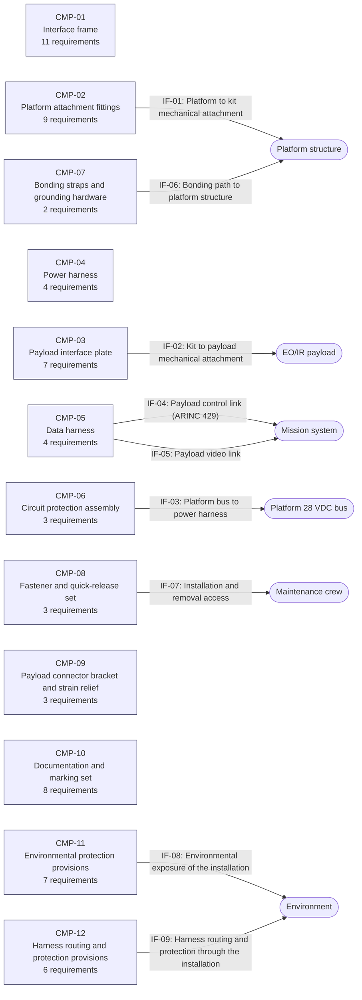

<!-- Generated by tools/diagram.py — do not edit by hand. -->
<!-- Run: python -m tools.diagram -->

# Architecture

Generated from the architecture model and the requirements: the functions, the components that realise them, the interfaces and the external boundary.

## Diagram

## Functions

| Function | Name | Requirements | Realised by |
| --- | --- | --- | --- |
| FCT-01 | Attach the payload to the platform | SYS001 SYS006 SYS009 | CMP-01, CMP-02, CMP-03 |
| FCT-02 | Transfer payload loads to the platform primary structure | SYS002 SYS003 SYS004 SYS005 SYS007 SYS024 SYS025 SYS026 SYS028 SYS029 | CMP-01, CMP-02 |
| FCT-03 | Supply and protect payload electrical power | SYS010 SYS011 SYS032 | CMP-04, CMP-06, CMP-12 |
| FCT-04 | Route payload control and video data | SYS012 SYS030 SYS031 | CMP-05, CMP-09, CMP-12 |
| FCT-05 | Bond the payload to the platform ground reference | SYS013 | CMP-07 |
| FCT-06 | Allow installation, removal and inspection | SYS018 SYS019 SYS028 SYS031 | CMP-08, CMP-09, CMP-12 |
| FCT-07 | Preserve payload field of view and clearances | SYS008 SYS009 | CMP-01, CMP-03 |
| FCT-08 | Carry installation identity and compliance data | SYS020 SYS021 SYS022 SYS023 SYS036 SYS037 SYS038 | CMP-10 |
| FCT-09 | Sustain the environmental and electromagnetic environment | SYS014 SYS015 SYS016 SYS017 SYS027 SYS033 SYS034 SYS035 | CMP-11, CMP-12 |

## Components

| Component | Name | Realises | Requirements |
| --- | --- | --- | --- |
| CMP-01 | Interface frame | FCT-01, FCT-02, FCT-07 | SYS001 SYS002 SYS003 SYS005 SYS007 SYS008 SYS009 SYS024 SYS025 SYS027 SYS028 |
| CMP-02 | Platform attachment fittings | FCT-01, FCT-02 | SYS001 SYS002 SYS003 SYS004 SYS024 SYS026 SYS027 SYS028 SYS029 |
| CMP-03 | Payload interface plate | FCT-01, FCT-07 | SYS001 SYS006 SYS008 SYS009 SYS024 SYS026 SYS029 |
| CMP-04 | Power harness | FCT-03 | SYS010 SYS011 SYS030 SYS033 |
| CMP-05 | Data harness | FCT-04 | SYS012 SYS016 SYS030 SYS035 |
| CMP-06 | Circuit protection assembly | FCT-03 | SYS010 SYS011 SYS032 |
| CMP-07 | Bonding straps and grounding hardware | FCT-05 | SYS013 SYS035 |
| CMP-08 | Fastener and quick-release set | FCT-06 | SYS018 SYS026 SYS027 |
| CMP-09 | Payload connector bracket and strain relief | FCT-04, FCT-06 | SYS018 SYS019 SYS031 |
| CMP-10 | Documentation and marking set | FCT-08 | SYS007 SYS020 SYS021 SYS022 SYS023 SYS036 SYS037 SYS038 |
| CMP-11 | Environmental protection provisions | FCT-09 | SYS014 SYS015 SYS016 SYS017 SYS027 SYS033 SYS034 |
| CMP-12 | Harness routing and protection provisions | FCT-03, FCT-04, FCT-06, FCT-09 | SYS030 SYS031 SYS033 SYS034 SYS035 SYS038 |

## Interfaces

| Interface | Name | From | To | Requirements |
| --- | --- | --- | --- | --- |
| IF-01 | Platform to kit mechanical attachment | CMP-02 | EXT-PLATFORM | SYS001 SYS004 |
| IF-02 | Kit to payload mechanical attachment | CMP-03 | EXT-PAYLOAD | SYS001 SYS006 |
| IF-03 | Platform bus to power harness | CMP-06 | EXT-PLATFORM-BUS | SYS010 SYS011 |
| IF-04 | Payload control link (ARINC 429) | CMP-05 | EXT-MISSION-SYSTEM | SYS012 |
| IF-05 | Payload video link | CMP-05 | EXT-MISSION-SYSTEM | SYS012 |
| IF-06 | Bonding path to platform structure | CMP-07 | EXT-PLATFORM | SYS013 |
| IF-07 | Installation and removal access | CMP-08 | EXT-MAINTAINER | SYS018 SYS019 |
| IF-08 | Environmental exposure of the installation | CMP-11 | EXT-ENVIRONMENT | SYS014 SYS015 SYS016 SYS017 SYS033 SYS034 |
| IF-09 | Harness routing and protection through the installation | CMP-12 | EXT-ENVIRONMENT | SYS030 SYS031 SYS035 |

## External boundary

| External | Meaning |
| --- | --- |
| EXT-PLATFORM | Platform structure |
| EXT-PAYLOAD | EO/IR payload |
| EXT-PLATFORM-BUS | Platform 28 VDC bus |
| EXT-MISSION-SYSTEM | Mission system |
| EXT-MAINTAINER | Maintenance crew |
| EXT-ENVIRONMENT | Environment |
